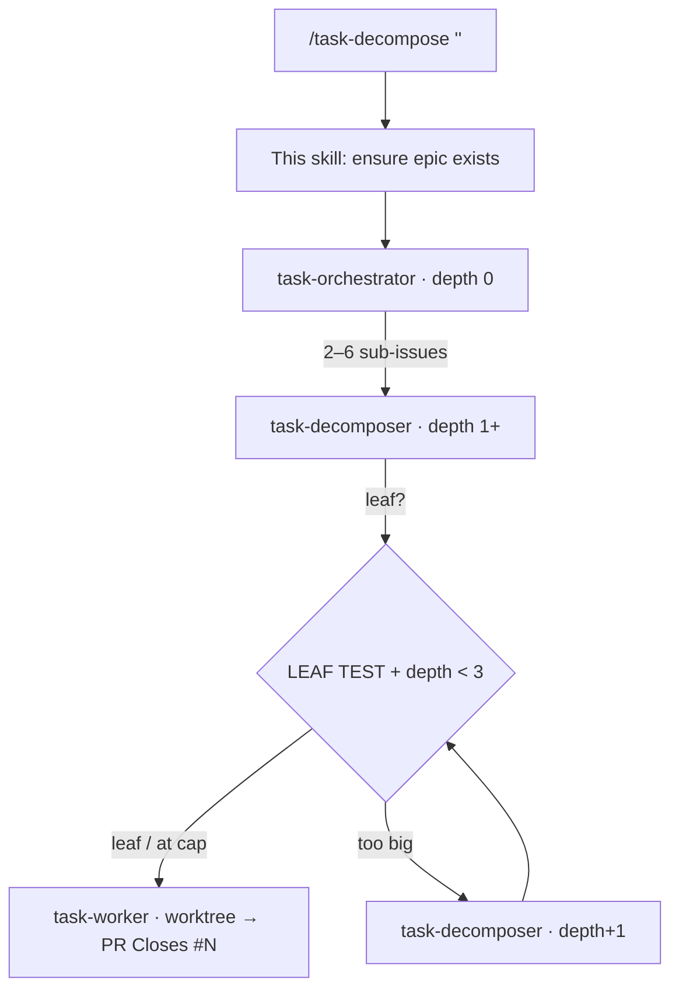

# Task Decompose

The single entry point for the **recursive task-decomposition agent pipeline**. One task
in → an epic with a tree of sub-issues, each leaf worked by an agent on its own branch.

## The three agents

| Agent | Role | Recurses? | Spawns |
|-------|------|-----------|--------|
| `task-orchestrator` | reads the epic, makes 2–6 top-level sub-issues | no | a decomposer per child |
| `task-decomposer`   | LEAF TEST one issue: split or build | **yes** | decomposers (split) or a worker (leaf) |
| `task-worker`       | implements one leaf issue → PR | no | nothing (terminal) |

## Stop-conditions (so it can't run away)

- **MAX_DEPTH = 3** — at depth 3 the decomposer stops splitting and treats the issue as a
  leaf, however big it looks.
- **MAX_CHILDREN = 6** — at most 6 children per split (orchestrator and decomposer alike).
- **LEAF TEST (all four)** — single coherent change · bounded file set · clear/testable
  acceptance · doable in one focused worker run. All true ⇒ build it, don't split.

To tune the limits, edit the numbers in `.claude/agents/task-decomposer.md` (and the
orchestrator's MAX_CHILDREN).

## Integration-branch flow & safety (#348 hardening)

Learned from the #325 run, where parallel workers — branching off `main`, unable to see
each other's unmerged work — each re-created the same new package and a couple silently
chose a different design. Four rules now prevent that:

1. **Epic integration branch (#349).** The orchestrator creates `epic/<NN>-<slug>` off
   `main`. Every sub-issue branches off **that** branch and targets its PR **at** it (not
   `main`), so a later sub-issue sees what an earlier one built — no duplicate scaffolds.
   The whole feature gets **one** human review when `epic/<NN>` is PR'd into `main` at the
   end (the epic is "done" only then, not when its children merge into the epic branch).
   Dependency-ordered children are **wave-gated** (foundation merges first, then dependents
   on an idempotent re-run); independent ones still run in parallel. **The branch is keyed by
   the epic NUMBER, not the slug (#611):** a re-dispatch resolves and **reuses** any existing
   `epic/<NN>-*` (merging `main` into it), never minting a second slug — so re-runs can't leave
   sibling epic branches behind.

2. **Epic-scoped package approval (#350).** A package-touching epic is approved **once**:
   the `packages/` gate honours the **`CROUTON_PACKAGE_EDIT_APPROVED`** env var (inherited
   by every spawned worker), so you don't unlock per-worker. **Never** commit the
   `.claude/.package-edit-approved` file — `guard-package-approval.yml` fails any PR to
   `main` that contains it (env can't leak; a committed file would disable the gate for all).

3. **Review dial (#351).** Risky epics (create a package / change schema / dependency
   chain, or labelled `review:plan`) **pause for human plan-approval before any worker
   runs** — the orchestrator posts the proposed tree, @mentions `@pmcp`, blocks. Plus the
   epic→`main` PR is the integration review. Low-risk epics (`review:auto`) skip the gate.

4. **Block, don't improvise (#352).** A worker that finds a prerequisite missing (a
   package/table/symbol a sibling owns, not yet merged) **stops and waits** — it never
   scaffolds the missing thing itself, and never silently diverges from the epic's stated
   design invariants. Missing prerequisite = blocker, not a DIY.

## `.github/workflows/` boundary — embed-patch, don't block (#1076)

The Harness App token backing this pipeline (and pi's headless runs) deliberately **lacks the
`workflows` write scope** — decided as a hard, permanent boundary rather than granting it,
because a token that can edit its own CI can also alter its own guardrails. A commit touching
`.github/workflows/**` is hard-rejected by GitHub regardless of who/what is running.

If a leaf's work needs a workflow-file change (new trigger, path filter, job):

- Do **not** treat it as a blocker to stop-and-wait on — it's a known limit of your write access,
  not a missing prerequisite. Commit everything else in the PR normally.
- Embed the workflow diff verbatim as a `git apply`-able fenced diff block in the PR body under a
  `## Workflow patch (human applies)` heading (see PR #1075 for the exact shape).
- Post a plain top-level issue comment (never a PR *review* body) naming the pending patch and
  @mentioning `NOTIFY_HANDLE`. Add `status:blocked` only if the omitted workflow change is
  load-bearing for the rest of the PR; otherwise it's an FYI, not a hold.
- **This is a complete deliverable, not a partial run** — "PR opened + workflow patch embedded
  for a human" is a first-class PASS, exactly like any other linked-PR run. Don't spend extra
  turns hunting for a way to write the workflow file anyway.

## Triggers (manual + automatic)

- **Manual:** run `/task-decompose "<task>"` or `/task-decompose #NN` in any Claude Code
  session (CLI, web, desktop, mobile app).
- **Automatic — issue opt-in:** add the **`delegate`** label to any issue and
  `.github/workflows/decompose-on-issue.yml` runs `/task-decompose #NN` for you (no
  command needed). Gate is the label, so only opted-in issues fire.
- **By comment (mobile-friendly):** comment **`/delegate`** (or **`/deploy`**) on an issue —
  `.github/workflows/comment-dispatch.yml` applies the `delegate` label for you (via a PAT, so
  the run is human-actored). Same effect as labelling, but you can do it from the GitHub mobile
  app where the label UI is awkward. Owner/members only.
- **Automatic — resume after a blocker:** when an agent @mentions you and sets
  `status:blocked`, just **reply on the issue** — `.github/workflows/resume-on-comment.yml`
  picks it back up, removes the block, and continues.

### Auth & billing (read before changing the workflows)

- **Interactive runs (you typing `/task-decompose` in a CLI / web / app session)** run on
  **whatever your session is logged into** — a **Claude Pro/Max subscription is fine**;
  this is ordinary interactive Claude Code use.
- **The automated workflows are headless/unattended, so they MUST use an
  `ANTHROPIC_API_KEY`** repo secret (same as `claude.yml`) — pay-per-token. **Do NOT wire
  them to a subscription `CLAUDE_CODE_OAUTH_TOKEN`.** Per Anthropic's Legal & Compliance
  terms, subscription OAuth is for *ordinary, individual, interactive* use of Claude Code,
  **not** CI / Agent-SDK / headless automation (which bills at standard API rates). Using a
  subscription token to drive these workflows would be against the terms.
- Cost is therefore a real factor on the automated path — see the model split in
  `.claude/agents/CLAUDE.md` (Sonnet for the issue-only agents, Opus only for the worker)
  and the `MAX_DEPTH`/`MAX_CHILDREN` caps that bound fan-out.

## How to run

`$ARGUMENTS` is either:
- **free text** — a task description → create a new epic, then orchestrate; or
- **`#NN` / a number** — an existing issue → reuse it as the epic, then orchestrate.

### Procedure

1. **Resolve the epic.**
   - If `$ARGUMENTS` is (or contains) an issue number: `issue_read` it; use it as the epic.
   - Else: **dedup first** — run the **`issue-dedup`** skill (search open **and**
     recently-closed work by keywords + `epic` label, surface matches, decide reuse /
     replace / new). If a matching epic exists, **reuse it** — don't mint a duplicate.
     Otherwise create one with `issue_write` (method `create`):
     - title: plain human English (no jargon);
     - labels: `epic` + the component it primarily spans (`pkg:*`/`app:*`; never `root`).
       For dev-tooling/`.claude` work that serves the whole monorepo, use `meta:agents`;
     - body: `## 👤 For humans`, `## 🤖 For agents`, `## 🧪 How to test` per `github-tasks`,
       ending with a `Dedup-checked:` attestation line — the `require-issue-dedup` hook
       **blocks the create without it** (#297).
2. **Launch the orchestrator.** Spawn it via the `Agent` tool:
   - `subagent_type: "task-orchestrator"`
   - prompt: `{ epic_issue_number: <epic number>, depth: 0 }` + a short restatement of the
     task so it doesn't need an extra read.
   - **If `#NN` is a CHILD issue (it has a `parent_issue_url`), not an epic** — e.g. someone
     `delegate`'d / `/deploy`'d a single sub-issue from the mobile app — pass its parent epic
     as `epic_issue_number` and name the child to work, OR pass the child with a note that it
     is a child: the orchestrator must work it on the **parent's** `epic/<parent>-<slug>`
     branch, **never** mint a new epic off `main` (where the scaffold wouldn't exist). The
     pipeline hands off by **spawning** agents (`Agent` tool), never by applying the
     `delegate` label from inside a run (that's bot-actored and self-rejecting).
3. **Report** the epic url and that orchestration has started. The orchestrator creates the
   `epic/<NN>-<slug>` integration branch; the tree then builds itself onto it (decomposers
   recurse; workers open PRs into the epic branch with `Closes #NN`); a single epic→`main`
   PR lands the lot behind one review.

## Building an app? It's a POC by default — end at a preview URL

When the task is **"build an app / build X"** (a runnable app, not a package or tooling change), it is a **POC by default** — the user does **not** need to say "as a poc":

- **Default to POC.** In an *interactive* session you MAY ask once **"POC (preview) or launched app?"** — but the default is **POC**, and when running **headless you never ask** (the pipeline can't block): always POC. An app only starts in `apps/` if the user *explicitly* says it's a production launch.
- **Scaffold under `pocs/<name>`, NOT `apps/`** — the safe-to-break incubator (root `CLAUDE.md`). Label its issues `poc:<name>`. `apps/` is only for launched apps with a production counterpart.
- **Step 0 — package-fit check FIRST (#292).** *Before* slicing the workstreams below, check whether an existing `@fyit/crouton-*` package already does most of the work: read `.claude/skills/task-decompose/package-catalog.md` (one lookup — generated by `scripts/gen-package-catalog.mjs`), and if a package fits, propose **Option A** (build *on* it) vs **Option B** (from scratch) on the epic, **default to reuse**, and slice **along the chosen path**. Order: internal packages → `ecosystem-check` (external OSS) → build. This is mandatory for app/build epics — the #274 blog hand-rolled a `posts` collection + reader when a blog ≈ a `crouton-pages` page-type + `crouton-editor` body. Full procedure: the task-orchestrator's **Step 0** section.
- **Canonical workstream order for a crouton app — use the CLI, NEVER hand-mirror.** A crouton app build decomposes into this fixed shape. Do not reinvent it, and do **not** tell a worker to "mirror `pocs/blog`" or hand-copy another app — that is how versions drift:
  1. **Design the data model + generation plan, then SIGN OFF.** Draft both `schemas/*.json` (the fields) **and** `crouton.config.js` (collections, target `layer`, `features`, `locales`, `dialect`). Run the **`schema-review`** skill and get human sign-off on **both** before any code is generated — the config decides the forms / list views / API surface, so it is reviewed *alongside* the schema, not after. **Post the review, the `@mention`, and `status:blocked` on this workstream's OWN issue (or its draft PR) — NEVER on the epic.** This *is* the schema/config sign-off issue, so the field tables, the config, the ping, and the human `approve` reply all live in one place; the epic only carries the final verify rollup. (If a step would touch `packages/`, the HARD GATE applies — but a normal POC build never does.)
  2. **`crouton init <name> --features …`** — one deterministic pass that **scaffolds the app *and* generates** the collections / forms / API / Drizzle **schema** from the approved schema+config. The CLI pulls pinned versions from a single source (`getFrameworkPackages`), so apps never drift. (`crouton scaffold-app` is the scaffold-only fallback; `crouton add` to bolt on features later.) ⚠️ **It does NOT generate the D1 _migrations_** — `crouton config` has no migration logic, so the fresh app has a Drizzle schema but **no `server/db/migrations/sqlite/`**.
  2b. **Generate + commit the initial migrations** — do **not** skip this, or the deploy's remote-migrate step fails with *"No migrations present"* (the gap that bit library-catalog, #457). Per the **`db-migrations`** skill's build-first workaround: `NITRO_PRESET=node-server nuxt build` until `.nuxt/hub/db/schema.mjs` appears → `pnpm db:generate` → **commit** `pocs/<name>/server/db/migrations/sqlite/**` (the `.sql` + `meta/`).
  3. **Deploy a review-on preview** — run `pnpm poc:scaffold-deploy <name>` and open the PR so CI deploys an isolated staging Worker (with `NUXT_PUBLIC_CROUTON_REVIEW=true` + the review-bridge env) and posts the **`https://<name>.pmcp.dev`** URL (auth-working). This comes **before** UI refinement on purpose: the UI sign-off is now done **on the live preview** (#590/#488), and you can't click-to-comment on a page that isn't deployed. See the **`poc-deploy`** skill.
  4. **Refine the UI — on the live preview (the sign-off gate).** Forms / UI polish, search, etc., reviewed via the live-preview loop: the reviewer clicks an element on the deployed page → a `🎯 Preview feedback` comment names the source `.vue` → the worker fixes it and **redeploys the same `<name>.pmcp.dev`** → iterate → `approve` (a comment). (Static mockup is the `--static` fallback when no deploy is possible, e.g. a package-only change.)
- **Deploy BEFORE refine — never the reverse.** Ordering refine before deploy creates a chicken-and-egg (the UI review needs a running page; the page needs a deploy) — that's the circular dependency to avoid. So a crouton-app epic is: schema → `crouton init` → **deploy preview** → **refine on the live preview**. The deploy-preview is a prerequisite of the UI gate, not the finale.
- **The endpoint is a deployed, testable preview URL — not merged code.** The preview exists from step 3 and every refinement re-rides the same URL; don't call the build "done" until that preview is live, auth-works, and the UI sign-off is approved. See the **`poc-deploy`** skill.
- **Testable with auth:** the POC's `seed` provisions a known admin; the epic's verify rollup hands back the URL **and** the login. Don't call an app build "done" until the preview URL is live.
- **Promotion is a separate, explicit step.** A POC graduates to production by being promoted **`pocs/<name>` → `apps/<name>`** (taking on `apps/` rigor, the `app:<name>` label, and a prod two-domain deploy). Never automatic — only on an explicit "launch/promote" request.

## Notifications & async Q&A (`NOTIFY_HANDLE = @pmcp`)

Headless/automation runs (a webhook- or Action-triggered session) have **no human
attached**, so agents must **never block-and-wait** on a question — `AskUserQuestion`
just times out there. Instead the pattern is **comment-and-stop**, and the comment
**@mentions the notify handle** so the owner gets a real GitHub notification (which
surfaces in the GitHub / Claude mobile app):

- **Small ambiguity** → decide with a sensible default, record the assumption in the
  issue body, keep going. *No mention* (don't spam).
- **Progress / status update** ("spawning the worker for #NN", "wave 2 of 4 starting",
  "preview deploying") → a plain `add_issue_comment` with **no @mention**. An @mention is
  a request for the human to *act*; an FYI is not. If nothing is required of the owner,
  do not ping them — post the update unmentioned (or skip it).
- **Real blocker / decision needed** → `add_issue_comment` on the issue with a tight
  question + options, **@mention `NOTIFY_HANDLE`**, apply the `status:blocked` label,
  then **stop** that branch. The owner replies on the issue; a resume trigger (or a
  human re-running `/task-decompose #NN`) picks the thread back up.
- **Epic done** → when the last child merges, the verify-rollup comment on the epic
  also @mentions `NOTIFY_HANDLE` (per `github-tasks`).

**Every actionable ping is a TOP-LEVEL comment.** A blocker question **or a sign-off request**
goes out as `add_issue_comment` (a top-level issue/PR comment) — that notifies reliably.
**Never bury the ask in a PR *review* body** (state `COMMENTED`): it's a weak surface the owner
misses (the #846 sign-off case, where pi's `lgtm/approve` ping sat inside a review). Detailed
review/analysis can live in its own artifact; the `@mention` + `status:blocked` ask stands alone
on top.

To change who gets pinged, edit `NOTIFY_HANDLE` here and in `.claude/agents/CLAUDE.md`.

## Notes

- Everything persists as real GitHub issues (epic → sub-issues → sub-sub-issues), so the
  tree survives across sessions and shows progress bars on each parent.
- Workers run in **git worktree isolation** — parallel leaves never collide; they branch
  off and PR into the **epic branch**, not `main` (see "Integration-branch flow").
- This plugs into the repo's ISSUE-FIRST + `github-tasks` + `/commit` + merge-policy
  workflow; the agents enforce those rules themselves.
- Sub-PRs may auto-merge into the **epic branch** (a staging area). The final
  **epic→`main`** PR is **not** auto-merged — that's the human review/merge gate.
