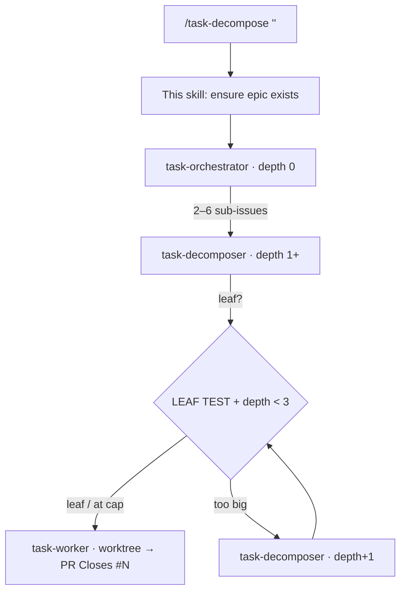

# Task Decompose

The single entry point for the **recursive task-decomposition agent pipeline**. One task
in → an epic with a tree of sub-issues, each leaf worked by an agent on its own branch.

## The three agents

| Agent | Role | Recurses? | Spawns |
|-------|------|-----------|--------|
| `task-orchestrator` | reads the epic, makes 2–6 top-level sub-issues | no | a decomposer per child |
| `task-decomposer`   | LEAF TEST one issue: split or build | **yes** | decomposers (split) or a worker (leaf) |
| `task-worker`       | implements one leaf issue → PR | no | nothing (terminal) |

## Stop-conditions (so it can't run away)

- **MAX_DEPTH = 3** — at depth 3 the decomposer stops splitting and treats the issue as a
  leaf, however big it looks.
- **MAX_CHILDREN = 6** — at most 6 children per split (orchestrator and decomposer alike).
- **LEAF TEST (all four)** — single coherent change · bounded file set · clear/testable
  acceptance · doable in one focused worker run. All true ⇒ build it, don't split.

To tune the limits, edit the numbers in `.claude/agents/task-decomposer.md` (and the
orchestrator's MAX_CHILDREN).

## Triggers (manual + automatic)

- **Manual:** run `/task-decompose "<task>"` or `/task-decompose #NN` in any Claude Code
  session (CLI, web, desktop, mobile app).
- **Automatic — issue opt-in:** add the **`auto-decompose`** label to any issue and
  `.github/workflows/decompose-on-issue.yml` runs `/task-decompose #NN` for you (no
  command needed). Gate is the label, so only opted-in issues fire.
- **Automatic — resume after a blocker:** when an agent @mentions you and sets
  `status:blocked`, just **reply on the issue** — `.github/workflows/resume-on-comment.yml`
  picks it back up, removes the block, and continues. (Both workflows need the
  `ANTHROPIC_API_KEY` repo secret, same as `claude.yml`.)

## How to run

`$ARGUMENTS` is either:
- **free text** — a task description → create a new epic, then orchestrate; or
- **`#NN` / a number** — an existing issue → reuse it as the epic, then orchestrate.

### Procedure

1. **Resolve the epic.**
   - If `$ARGUMENTS` is (or contains) an issue number: `issue_read` it; use it as the epic.
   - Else: **search first** (`search_issues`/`list_issues` by keywords + `epic` label) to
     avoid a duplicate. If a matching epic exists, reuse it. Otherwise create one with
     `issue_write` (method `create`):
     - title: plain human English (no jargon);
     - labels: `epic` + the component it primarily spans (`pkg:*`/`app:*`; never `root`).
       For dev-tooling/`.claude` work that serves the whole monorepo, use `meta:agents`;
     - body: `## 👤 For humans`, `## 🤖 For agents`, `## 🧪 How to test` per `github-tasks`.
2. **Launch the orchestrator.** Spawn it via the `Agent` tool:
   - `subagent_type: "task-orchestrator"`
   - prompt: `{ epic_issue_number: <epic number>, depth: 0 }` + a short restatement of the
     task so it doesn't need an extra read.
3. **Report** the epic url and that orchestration has started. The tree then builds itself
   (decomposers recurse; workers open PRs with `Closes #NN`).

## Notifications & async Q&A (`NOTIFY_HANDLE = @pmcp`)

Headless/automation runs (a webhook- or Action-triggered session) have **no human
attached**, so agents must **never block-and-wait** on a question — `AskUserQuestion`
just times out there. Instead the pattern is **comment-and-stop**, and the comment
**@mentions the notify handle** so the owner gets a real GitHub notification (which
surfaces in the GitHub / Claude mobile app):

- **Small ambiguity** → decide with a sensible default, record the assumption in the
  issue body, keep going. *No mention* (don't spam).
- **Real blocker / decision needed** → `add_issue_comment` on the issue with a tight
  question + options, **@mention `NOTIFY_HANDLE`**, apply the `status:blocked` label,
  then **stop** that branch. The owner replies on the issue; a resume trigger (or a
  human re-running `/task-decompose #NN`) picks the thread back up.
- **Epic done** → when the last child merges, the verify-rollup comment on the epic
  also @mentions `NOTIFY_HANDLE` (per `github-tasks`).

To change who gets pinged, edit `NOTIFY_HANDLE` here and in `.claude/agents/CLAUDE.md`.

## Notes

- Everything persists as real GitHub issues (epic → sub-issues → sub-sub-issues), so the
  tree survives across sessions and shows progress bars on each parent.
- Workers run in **git worktree isolation** — parallel leaves never collide.
- This plugs into the repo's ISSUE-FIRST + `github-tasks` + `/commit` + merge-policy
  workflow; the agents enforce those rules themselves.
- It does **not** auto-merge PRs. Review/merge (or have a PR watcher do it) as usual.
