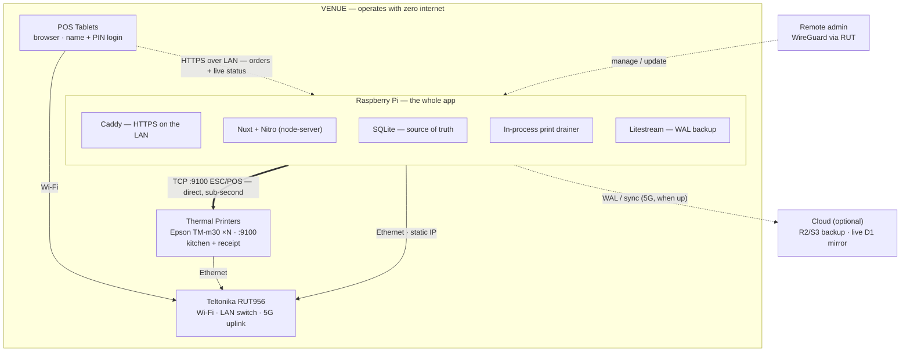

# Venue Local-First Architecture — Running the Whole App on a Pi

## Summary

For event/POS deployments (e.g. fanfare), run the **entire Nuxt app on a Raspberry Pi at the venue**, with a Teltonika RUT956 as the network. The Pi is the authoritative source of truth and operates with **zero internet**; the cloud is a continuously-synced mirror/backup that catches up whenever the 5G uplink is available. This document captures the target topology, the dual-target ("local + Cloudflare") strategy, the sync model and its consistency trade-off, and the RUT network/firewall configuration.

It also covers the broader generalization the same codebase must support: **deployment profiles** that span everything from a full venue rig down to "just a few phones with no infrastructure," and an **output-driver** model that generalizes the hardcoded "printer" so the app works equally with thermal printers, a bring-your-own printer, an iPad used as a display, or no printer at all.

This is an architecture decision record, not an implementation guide. Code changes are scoped at the end under "Migration surface".

## Why this shape

The current production flow is **cloud-authoritative, edge-executed**: orders and print jobs live in Cloudflare D1, and a shell spooler on the RUT polls the cloud and drives the printer over the LAN. Every print round-trips through the internet, so a connectivity drop halts ordering and printing even though the tablet and printer are on the same LAN.

Running the app on the Pi inverts this: the venue becomes self-contained. It also erases a whole class of complexity that exists *only* to survive Cloudflare Workers (no sockets, no native deps) — most importantly, printing collapses from "queue + remote spooler + poll" into direct in-process TCP.

## Topology (lean, middle-of-the-road)

One box does the work, the RUT is just plumbing, the cloud is insurance.



- **POS tablets** — load the web app from the Pi over the LAN; volunteers authenticate with name + PIN (scoped-access grants).
- **Teltonika RUT956** — Wi-Fi AP + LAN switch + 5G WAN. The 5G is used **only** for cloud sync and remote admin, never for the print path.
- **Raspberry Pi — the whole app**, running:
  - **Caddy** — terminates HTTPS on the LAN (local cert) so auth cookies, passkeys, and PWA/secure-context features work.
  - **Nuxt + Nitro** on the `node-server` preset (not the Cloudflare build).
  - **SQLite** — the source of truth (better-sqlite3 or libsql).
  - **In-process print drainer** — opens TCP `:9100` to the printers directly; no shell spooler, no polling.
  - **Litestream** — streams the SQLite WAL to object storage continuously.
- **Thermal printers** (Epson TM-m30 × N) — wired to the RUT LAN, static IPs, port 9100, kitchen (per location) + receipt.
- **Cloud (optional)** — object storage (R2/S3) for backup/restore, and optionally a live D1 mirror for cross-venue reporting.

### Traffic paths

| Path | Medium | Needs internet? |
|------|--------|-----------------|
| Tablet → Pi (orders, live status, UI) | LAN (Wi-Fi → switch) | No |
| Pi → Printers (ESC/POS) | LAN (TCP :9100) | No |
| Pi → Cloud (sync/backup) | 5G WAN | Yes (opportunistic) |
| Remote admin → Pi | WireGuard via RUT | Yes |

Local operation never leaves the building; the cloud layer runs concurrently on top whenever the link is up.

## Local + online at the same time

Local-first does **not** mean offline-only. The Pi serves the LAN unconditionally **and**, when the 5G is up, simultaneously backs up, syncs, and is remotely reachable. If the link drops, only the online half pauses; orders and printing keep flowing locally and reconcile on reconnect.

## Sync model — and who owns the truth

There is an unavoidable trade-off to state plainly:

> You cannot have both "the Pi works fully offline" **and** "Cloudflare is the canonical truth in real time." During an outage the venue keeps writing to the Pi, so any cloud copy is stale until reconnect.

**Decision: the Pi is the authoritative writer.** Cloudflare is a continuously-updated mirror — live-current when connected, eventually-consistent after an outage. This preserves offline operation while keeping the truth in the cloud "whenever there is a link, and never lost otherwise."

Two mechanisms, chosen by what the cloud needs to be:

| Mechanism | What it gives | Cloud is… | Use when |
|-----------|---------------|-----------|----------|
| **Litestream** (continuous WAL → R2/S3) | A restorable replica, streamed every few seconds | **Safe** (DR), not live-queryable | You only need "never lose data" |
| **App-level push to D1** (outbox + idempotent upserts keyed by nanoid) | A live, queryable mirror of orders/print status | **Queryable** (dashboards) | You want a central cross-venue dashboard |

Both are cheap over 5G — order/print events are kilobytes. Start with Litestream (near-zero app code); add the app-level push only when a live cloud dashboard is actually needed.

### Order numbering offline

`eventOrderNumber` is currently assigned cloud-side as `count + 1`. On a single authoritative Pi this is *simpler*: one local sequence, no contention. The human-facing number becomes Pi-local, which for a single venue is correct. (Multi-writer offline would need per-device ranges — not needed here.)

## Dual-target: local Pi + Cloudflare from one codebase

Supporting both runtimes is tractable because **both targets are SQLite** — D1 and better-sqlite3/libsql share the dialect, so schema, Drizzle queries, and migrations are identical. Don't fork the app; introduce a thin **ports-and-adapters** layer for the four things that actually differ, chosen at boot by `NITRO_PRESET`/env:

| Port | Cloudflare adapter | Node (Pi) adapter |
|------|--------------------|-------------------|
| **Database** (`useDB()`) | `drizzle(hubDatabase())` (D1) | `drizzle(betterSqlite3(...))` |
| **Printer drainer** | Remote: RUT shell spooler polls `/jobs`, posts `/complete`+`/fail` | In-process loop: read queue → DLE-EOT pre-flight → TCP :9100 → same complete/fail transitions |
| **KV** (`useKV()`) | NuxtHub KV | unstorage fs/sqlite driver |
| **Blob** (`useBlob()`) | NuxtHub Blob (R2) | unstorage fs driver |

**Printing stays unified on purpose.** Enqueue to `salesPrintqueues` on *both* targets — the data model, the status LEDs, `retry-failed`, and the `print_failed` order status are identical everywhere. Only the **drainer** swaps (remote spooler vs in-process loop), and both converge on the same status transitions. The existing Cloudflare path keeps working unchanged.

### Build

- One codebase, two presets: `NITRO_PRESET=cloudflare-pages` vs `node-server`.
- Make the Workers stubs **conditional** — the `cf-stubs` aliases in `nuxt.config.ts` should apply only when `process.env.NITRO_PRESET === 'cloudflare-pages'`, so the node build keeps the real deps (passkeys, etc.).
- **CI must build *and* smoke-test both targets**, or the unused path silently rots. This is the recurring tax of dual-target — budget for it.
- **Discipline rule:** no D1-only or Node-only SQL/features in domain code. Anything runtime-specific goes behind a port, never inline.

## Deployment profiles

The venue rig above is one point on a spectrum. The same codebase must also serve customers who have **no Pi and no RUT** — just phones or iPads, or their own setup entirely. Two things vary independently, and the architecture keeps them orthogonal:

1. **Deployment topology** — where the app runs and where the truth lives.
2. **Output driver** — how an order gets fulfilled (next section).

| Profile | Runs on | Source of truth | Output | Offline? |
|---------|---------|-----------------|--------|----------|
| **Venue rig** | Pi (+ optional RUT) | Pi SQLite | thermal TCP, or any driver | ✅ fully offline |
| **Cloud / zero-infra (BYO)** | Cloudflare | Cloud D1 | browser drivers only | ⚠️ needs connectivity |
| **Self-hosted** | their own box (`node-server`) | that box | any driver | depends on their setup |

The BYO tier is just "the Cloudflare target + browser-native output drivers" — the same dual-target ports above, packaged as a profile. Self-hosting is the `node-server` target on arbitrary hardware.

**Decision: the zero-infra (BYO) tier is online-required.** Without a local server there is no local source of truth, so "keeps working offline" could only mean making the browser itself a local-first node — a PWA with IndexedDB + a multi-device **sync engine** to converge phones that took orders offline. That is a large, separate workstream and is **explicitly out of scope** until a real BYO customer demands offline-without-infrastructure. Offline resilience remains a property of the **venue (Pi)** profile only; most BYO setups (a stall with Wi-Fi or cell) accept "needs a connection."

**Consequence for BYO printing:** a cloud-hosted HTTPS app **cannot reach a printer's LAN IP** (mixed-content blocking). So in the cloud tier, output is always browser/OS-mediated — AirPrint via the print dialog, Web Bluetooth, or an on-screen display — never direct-to-IP. Direct-to-IP thermal printing is a venue/self-hosted-profile capability.

## Output drivers (generalizing the "printer")

Today `salesPrinters` fuses three concerns: **destination** (a network IP), **transport** (TCP :9100), and **render format** (ESC/POS). Generalizing means splitting them and putting a `driver` on the target (conceptually a "station" / "fulfillment target"):

The seam already exists. The formatter has a normalized **`ReceiptData` model** (`receipt-formatter.ts`), and `formatReceipt(data)` is just *one encoder* (→ ESC/POS). Build the ticket model once, then add sibling encoders:
- `formatReceipt(data)` → ESC/POS bytes (thermal) — exists
- `renderTicketHtml(data)` → print-styled HTML (browser/AirPrint/PDF)
- `toDisplayPayload(data)` → structured JSON (on-screen KDS)

| Driver | Output | Transport | Format | Profiles | iOS-friendly |
|--------|--------|-----------|--------|----------|--------------|
| `network-escpos` (default, existing) | thermal printer | LAN TCP :9100 | ESC/POS | venue, self-host | n/a (server-side) |
| `browser-print` | BYO printer via OS dialog | `window.print()` → AirPrint | HTML | any | ✅ |
| `webusb` / `bluetooth` | device-attached printer | WebUSB / Web Bluetooth | ESC/POS | any | ❌ (no iOS) |
| `display` (KDS) | on-screen order feed + "bump" | WebSocket/SSE subscribe | JSON | any | ✅ |
| `none` | digital only (orders list / customer screen) | — | — | any | ✅ |

**The queue stays universal.** `salesPrintqueues` remains the outbox for *every* driver; only the **drainer** differs — TCP socket (thermal), push-to-subscriber (display/browser clients), or browser-side render-and-print. The `display` driver uses a **display + acknowledge** lifecycle (`pending → shown → bumped`) instead of print + complete, but rides the same table and status UI.

**Data model:** add `driver` + a `config` JSON blob to `salesPrinters`; **existing rows default to `network-escpos`** so nothing breaks. Routing (items → location → station) is unchanged and driver-agnostic.

**Scenario mapping:**
- **No printer** → `display` or `none`.
- **Bring your own printer** → `browser-print` (AirPrint) on iPad; `webusb`/`bluetooth` on Android/desktop.
- **iPad as a printer replacement** → `display` (KDS).

**Recommended first driver: `display` (KDS).** It covers *both* "no printer" and "iPad as printer," works in every profile, is browser-native, and has zero iOS/mixed-content landmines — it's just a web client subscribing to the order feed you already have. `browser-print`/AirPrint is the fast follow; `webusb`/`bluetooth` is a later device-specific nicety.

## RUT956 network configuration

Goal: tablets reach the Pi over the LAN and use **their own cellular** for general web; **users never consume the venue's 5G**; only the Pi egresses to the WAN for sync.

- **Static IPs** on the LAN for the Pi and every printer. mDNS (`kassa.local`) so tablets don't chase IPs.
- **Firewall (the key rule):** drop `LAN → WAN` forwarding for the tablet subnet; add a single exception allowing the **Pi's static IP** out to the WAN (for sync/backup) and WireGuard for admin. Equivalent via a guest VLAN for client devices with no WAN route.
- **Result:** the client Wi-Fi has *no internet route*. Modern iOS/Android detect this and **fall back to cellular for internet while staying associated to Wi-Fi for LAN/local services** — so the POS works over Wi-Fi and personal browsing rides the user's own data. (Caveat: a one-time "Wi-Fi has no Internet — stay connected?" prompt; a few older Androids are twitchy holding a no-internet link. The LAN/POS path is solid regardless, being link-local.)
- **Bonus:** with only the Pi on the WAN, 5G data usage is fully predictable — spent on sync + admin, never on someone streaming at the bar.

```
  Tablets/phones ──Wi-Fi──▶ Pi + printers (LAN)        ✅ POS works, no internet needed
                 ──✗ blocked at RUT firewall──▶ 5G       ❌ no surfing on venue data
        └── own cellular ──▶ internet                     ✅ user's own data

  Pi ──(allowed: static IP only)──▶ 5G ──▶ Cloudflare     ✅ constant sync / backup
  Admin ──WireGuard via RUT──▶ Pi                          ✅ manage / push updates
```

## Operations

- **Durability (risk #1):** boot the Pi from an SSD (not SD), run SQLite in WAL mode, Litestream for point-in-time restore. If the Pi dies mid-event, restore onto a spare.
- **Deploy/update:** arm64 Docker image built in CI; run on the Pi via compose with a volume for the DB and a Litestream sidecar. Boot sequence: migrate → serve → replicate. Update = pull image.
- **Power:** a small UPS on the Pi + RUT is cheap event insurance.
- **HTTPS on the LAN:** Caddy with a local CA cert installed on tablets, or a real cert via DNS-01 for a hostname pointed at the LAN IP. Required for secure cookies / passkeys / PWA. Decide early — most likely thing to bite.
- **Auth origins:** if a single public hostname must also work on-site, set `BETTER_AUTH_TRUSTED_ORIGINS` for both origins and use split-horizon DNS. Lean default: local hostname on-site, VPN for remote.

## Migration surface (bounded, not a rewrite)

Concentrated seams, mostly already abstracted:

1. **`useDB()`** (`packages/crouton-auth/server/utils/database.ts`) — turn into a driver factory (D1 vs better-sqlite3). Single choke point.
2. **Two direct `hubDatabase()` calls** in `packages/crouton-auth/server/utils/team.ts` (~lines 317, 486) and the better-auth wiring — fold onto `useDB()`.
3. **`hubKV` / `hubBlob`** usages — wrap behind `useKV()` / `useBlob()` over unstorage.
4. **Printer drainer** — add an in-process Node drainer that reuses the existing `receipt-formatter.ts` (already dependency-free) and the existing complete/fail transitions; keep enqueue + schema + UI unchanged.
5. **`nuxt.config.ts`** — `node-server` preset for the Pi build; gate `cf-stubs` aliases behind the Cloudflare preset.
6. **CI** — build + smoke-test both presets.

The domain logic, schema, migrations, scoped-PIN volunteer auth, receipt formatting, and the entire Vue UI carry over unchanged.

## Open decisions

- Cloud role: **backup-only (Litestream)** vs **live mirror (app-push to D1)** — drives whether the outbox/ingest work is needed now.
- DB driver: **better-sqlite3** (simplest, native, single-box) vs **libsql** (keeps a future Turso embedded-replica option open).
- HTTPS-on-LAN: **internal CA cert on tablets** vs **real cert via DNS-01**.
- Commit to **node-only** vs maintain the full **dual-target** matrix (and its CI cost).
- Output drivers: which to build first (recommended **`display`/KDS**), and whether to rename the `salesPrinters` concept to "station" in the UI (table stays for back-compat).
- BYO offline: confirmed **out of scope** — revisit only if a real zero-infra customer requires offline ordering (would add a PWA sync-engine workstream).
