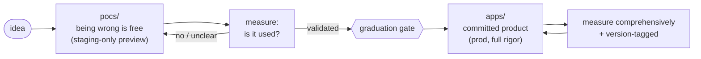

# Crouton — The Vision (canonical)

> **This is the one place the bigger story lives.** It pulls a through-line that was scattered
> across `writeups/marketing/nuxt-harness.html`, `writeups/briefings/crouton-os-vision-brief.md`,
> and the `writeups/strategy/atelier-*` set into a single read. It is **strategy framing, not agent
> instructions** — nothing here is a directive. Concrete, trackable work lives in GitHub epics
> (notably layout #703 and analytics #945).
>
> _Synthesised 2026-06-28 from the source docs cited inline. When those and this disagree, this is
> the intended-canonical statement; update it rather than forking a new vision doc._

---

## The one line

**Crouton is an app builder for the AI age that hands you the code.** Not vibe-to-lock-in —
**vibe-to-code.** AI gives you velocity; an opinionated, secured foundation gives you *a floor you
can't fall through*; and ownership means there's no ceiling and no eject cost — because there's
nothing to eject *from*. (`crouton-os-vision-brief.md:11-14`)

## The core thesis: ours appreciates, theirs degrades

Generic AI builders (Bolt, v0, Lovable, Replit Agent) are **vibe-to-running-app**: type a prompt,
watch something appear. They optimise for the demo, but the output is a fresh pile of code with no
spine — security, multi-tenancy, i18n, auth, deploy absent or reinvented badly each time — and the
code is usually *theirs*, behind a runtime or a subscription.

Crouton's bet is the inverse:

- **The base is always very good.** AI doesn't generate an app from zero — it generates the *delta*
  (schema, forms, specific screens) on top of a foundation that is **already load-bearing**.
- **You pour gold on top.** The foundation is structural concrete; the bespoke flows are the gold.
  AI pours gold well *when the form is already there to pour into* — without the form, gold puddles,
  which is why generic builders plateau.
- **The code is yours, completely.** Not a feature — the category. There's no platform to be locked
  into; you get a normal, excellent Nuxt codebase.

> *"Their base degrades as the app grows. Ours appreciates — because every generated collection
> follows the same patterns, the 30th feature is as clean as the 1st."* (`crouton-os-vision-brief.md:34-35`)

## The core loop: POC → validate → app (lean startup, made structural)

The methodology is a deliberate **three-tier lifecycle** — the lean-startup build-measure-learn loop
expressed as folders with different rules:

1. **`pocs/` — the incubator.** Experimental, churny, **safe to fail**; deploys are staging-only
   previews. A "build an app" request scaffolds here by default. The cost of being wrong is near
   zero. (`pocs/CLAUDE.md`)
2. **Refine in place, behind sign-off gates.** Three human gates keep velocity honest, each picked
   by *what the change is*:
   - **Schema sign-off (#314)** — agree the data model before generating.
   - **UI sign-off (#307)** — approve the look on a live preview before building it.
   - **Test sign-off (#774)** — agree the test before writing the logic (the "make it test-driven"
     half).
3. **Promote to `apps/` at launch.** A POC earns its way into `apps/` — production counterpart,
   two-domain deploy, full issue rigor — only when validated. That graduation is also when it goes
   **test-driven** and when analytics flips to comprehensive (see below).

> *"The generic builders have one mode: everything is production from keystroke one — so you're
> either reckless or slow. Crouton separates the two: a place where being wrong is free, and a
> deliberate gate to cross when you're right."* (`crouton-os-vision-brief.md:120-122`)

## The two pillars (+ one enabler)

**Pillar 1 — The Floor (Crouton OS).** The packages, generator, components, layers, auth, storage,
i18n, themes, deploy: the opinionated foundation that makes generated code load-bearing instead of
generic. Packages extend as **Nuxt layers**; multi-tenancy (`teamId` everywhere), auth, i18n, and
Cloudflare deploy are baked in. (`atelier-strategy.md:69-74`)

**Pillar 2 — The Harness.** The *way the work is driven*: issue-driven, skill-driven, and
**headless-capable**. Work lives as GitHub issues (epics → sub-issues); an issue *is* the prompt,
and an agent picks it up with the whole skill set (`/commit`, `crouton`, `/task-decompose`, deploy,
the `.claude/` arsenal) and emits a reviewed PR. *"Anyone can bolt an LLM onto a code generator;
almost nobody has a way of working where an issue is the prompt and an agent carries the whole skill
set to a PR."* (`crouton-os-vision-brief.md:78-86`)

**The layout maker** sits across both: a layout engine + placeable blocks
(`crouton-layout`, epics #703/#710) that compose components and arrange a fresh POC into a
viability-gated layout, so it boots *laid-out* (calendar-primary / master-detail) rather than as a
blank canvas. It's the fast "combine components, see how it looks" surface of the loop.

**Enabler — bring your own AI.** Model-agnostic. It completes the ownership story (no lock-in at the
code *or* model layer) but it's a checkbox under "it's yours," not the reason anyone chooses Crouton.

## The named gap — measurement — and how it's being closed

The vision has always known its weak spot. The central claim ("ours appreciates") is, in its own
words, **faith not data**:

> *"'Ours appreciates, theirs degrades' is the whole bet, and right now it's faith, not data. It is
> measurable, and we should treat proving it as a first-class goal, not a tagline."*
> (`crouton-os-vision-brief.md:38-39`) — measured via **time-to-POC**, **time-to-promote**, and
> **regressions over a lifetime**.

The lean loop above has a **build** half and a **measure** half — and only the build half was real.
**Closing the measure half is epic [#945](https://github.com/FriendlyInternet/nuxt-crouton/issues/945)** (`crouton-analytics`). Two design points that keep it on-brand:

- **One stable API, swappable backend.** Apps call `useCroutonAnalytics().track(...)`; PostHog sits
  behind it today (already wired in this org), Counterscale/Umami tomorrow — the `/provider-swap`
  pattern. No app rewrite to change tools — which *is* the no-eject-cost thesis applied to analytics.
- **Two postures, keyed to lifecycle stage:**
  - **POC → sparse, hypothesis-driven** — track only the few events that answer the *one* assumption
    the POC tests. Noise is a cost here.
  - **App → comprehensive** — once graduated, track as much as possible; we're optimising a committed
    product. The **graduation gate flips the posture** (one step of going test-driven, #951).
- **Version-tagged events** — when the in-flight version-lock work supplies a "what changed" id, every
  event carries it, so a metric move attributes to the exact change/experiment that caused it. That's
  what turns *measuring* into *learning* (#951, loosely coupled — degrades cleanly when absent).

## Naming lineage (so the docs stop confusing future readers)

| Name | Status | What it means |
|---|---|---|
| **Crouton** / `@fyit/crouton` | **Current** — the framework | "Crispy, reusable CRUD layers" (README). The packages + generator + layers. |
| **Nuxt Harness** | **Current** — marketing framing | The developer-facing "opinionated runtime + issue-driven workflow" angle (`marketing/nuxt-harness.html`). |
| **Atelier** | **The vision, not a current app** | What crouton *becomes* when the audience shifts from developers to organisations (`atelier-strategy.md:13`). A direction, not a tool. |
| `crouton-atelier` (pkg) / `apps/atelier` | **Parked** | The old visual kanban builder — superseded by the MCP/CLI pivot below. |

**The visual-builder pivot.** Crouton stopped building a web-UI app-builder; the route to the
Atelier vision is now the **MCP server + CLI as the product** — any AI client (Claude Code, Cursor,
a chat UI) scaffolds and evolves apps through self-documenting tools backed by the existing CLI.
*"The value is the guardrails, not the UI."* (`pivot-mcp-universal.md:1-3,18`)

## The scariest untested assumption

One level above "does the code stay clean": **does any of this work for a builder who isn't us?**
The whole thing is dogfooded by one person. *One external builder* taking an idea through to a
promoted production app — via the harness — would validate more of the company-level bet than another
package would. (`crouton-os-vision-brief.md:46-49`)

## Sources

- `writeups/briefings/crouton-os-vision-brief.md` — the primary thesis + the measurement gap
- `writeups/marketing/nuxt-harness.html` — the marketing framing ("the CLI is the runtime, the harness is the app")
- `writeups/strategy/atelier-strategy.md` · `atelier-plan.md` · `atelier-capabilities.md` — pillars, principles, capability map
- `writeups/strategy/pivot-mcp-universal.md` — the visual-builder → MCP/CLI pivot
- `writeups/strategy/nuxt-crouton-deep-dive.md` — capability inventory + gap analysis
- `pocs/CLAUDE.md` · root `CLAUDE.md` — the `pocs/ → apps/` lifecycle and sign-off gates in force
