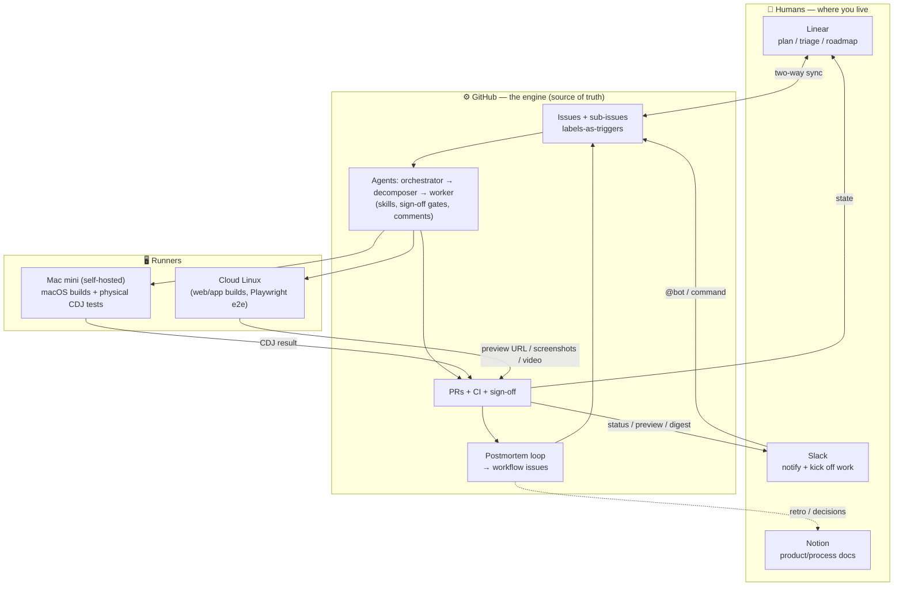

# New Workflow — Operating Model & Rollout (Handoff Briefing)

**Status:** draft for hand-off · **Date:** 2026-06-19
**Audience:** a fresh agent or teammate, dropped in cold, who needs to understand the
**new way of working** we're phasing in — *not* the Vue.js / crouton product itself.

> **How to use this doc.** Read it top to bottom once. It describes the target
> operating model, marks what **already exists** (so you can trust it / build on it)
> vs. what's **net-new** (still to build), and lays out a **phased rollout**. The
> living picture of the *existing* agent loop is `writeups/architecture/agent-flow.html`
> (+ `agent-orchestration-architecture.md`); this doc is the *target* and the *plan*.

---

## TL;DR — the bet

**Rent the orchestration, own the agents, self-host only what the cloud can't do, and let
the loop improve itself.**

- **GitHub is the engine** — issues, sub-issues, labels-as-triggers, PR sign-off, and
  Actions are what actually drive the agents. Keep it that way; it's not portable to a
  planning tool.
- **Agents/skills are ours and portable** — the value lives in skills + prompts + MCP, so
  the harness (Claude Code today, possibly `pi` later) stays swappable.
- **Self-host the runner (a Mac mini)** for the two things the cloud sandbox *cannot* do:
  **build/sign macOS apps** and **physical hardware tests** (the CDJ).
- **Humans live where it's comfortable** — plan/triage in **Linear** (mirrored from
  GitHub), get pinged in **Slack**, read docs in **Notion** — while the agents stay on
  GitHub.
- **The loop tightens itself** — every epic closes with a **postmortem** that mints
  `workflow` improvement issues. (Already live — see #403.)

---

## The operating model, visualized

**Reading it:** you steer from Slack/Linear; GitHub runs the actual agent loop; work is
executed on the right runner (cloud for software, Mac mini for macOS + hardware); results
flow back to where humans see them; the postmortem feeds improvements back into the board.

---

## The pieces — what each is, and does it exist yet?

| Capability | What it does | Status today | Evidence / where |
|---|---|---|---|
| **GitHub agent loop** | task → fan-out → workers → PR, with sign-off gates + comment steering | ✅ **Exists** | `.claude/agents/*`, `.claude/skills/*`, `agent-flow.html` |
| **Comment-driven control** | `@claude`, reply-to-resume, `auto-decompose` label | ✅ Exists | `claude.yml`, `resume-on-comment.yml`, `decompose-on-issue.yml` |
| **UI / schema sign-off** | mockup / field-table on a draft PR, human approves | ✅ Exists | `ui-proposal`, `schema-review` skills (#307/#314) |
| **Preview URLs** | every POC PR posts an auth-working staging link | ✅ Exists | `poc-deploy` skill (#265) |
| **Software e2e + video** | Playwright boot→login→CRUD, video/trace as CI artifact | ✅ Exists | `e2e/`, `e2e.yml` (#356) |
| **Postmortem self-improving loop** | retro at epic close → `workflow` issues | ✅ Exists (new) | `postmortem` skill (#403) |
| **Cloud execution** | agents run in the cloud (this session) | ✅ Exists | Claude Code on web |
| **Autonomous watch-to-merge** | sticky CI status, auto-merge on green, fix-bot on red | 🟡 **Partial** | #336 |
| **Self-hosted runner (generic)** | run an agent on your own box via Cloudflare Tunnel | 🟡 Runbook only | `self-hosted-pi-agent-cloudflare-setup.md`, `pocs/thinkgraph-worker` (reference) |
| **`pi` harness option** | provider-agnostic, portable packages over npm/git | 🟡 Evaluated, not adopted | `agent-orchestration-architecture.md` (decided: stay on Claude Code+GitHub for now) |
| **Mac mini runner** | macOS builds + always-on agent host + **physical tests** | 🔴 **Net-new** | — (generalize the pi runbook) |
| **Physical CDJ tests** | drive a real CDJ from code, assert, report to ticket | 🔴 Net-new (spike) | #420 |
| **Linear (two-way sync)** | humans plan in Linear, GitHub authoritative | 🔴 Net-new | Linear GitHub integration |
| **Slack** | notifications + an entry point to kick work | 🔴 Net-new | — |
| **Notion (docs)** | product/process knowledge base | 🔴 Net-new | Notion MCP available |
| **Multi-repo distribution** | one shared workflow across many repos | 🔴 Net-new | — |

> ✅ = working in `nuxt-crouton` today · 🟡 = partial / reference only · 🔴 = to build.

---

## How the human-facing tools move

### Linear (plan layer — GitHub stays the engine)
- **Two-way Issues Sync** mirrors titles/descriptions/state/comments between a GitHub repo
  and a Linear team; PR status moves the Linear issue through its workflow states.
- **GitHub is authoritative.** Agents read/write GitHub; Linear is the lens humans plan in.
- **Two caveats to design around:** (1) comments synced *from* Linear arrive as the
  integration **bot user**, and our agent triggers ignore bot comments — so *operating*
  the agents from Linear needs testing; (2) **PR-diff sign-off has no Linear surface** —
  approvals happen on the GitHub PR.

### Slack (notify + kick off)
- **Out:** CI status, help-pings (`status:blocked` + @you), preview URLs, the daily digest
  (`epic-digest`, #357) → Slack channels.
- **In:** a Slack command / `@bot` that opens or labels a GitHub issue (e.g.
  `auto-decompose`) to start the pipeline.

### Mac mini + physical tests (the self-hosted path)
- The **only** runner that can build/sign macOS apps **and** is physically wired to the CDJ.
- Pattern (from the pi runbook): always-on service, reachable via **Cloudflare Tunnel** +
  bearer/Access auth; the flow **dispatches** a job to it and it **posts the result back
  onto the ticket** like any other check. Heavy builds/typecheck still offload to CI.
- Physical CDJ test = a new **verify-step capability** beside `e2e-smoke` (spike #420:
  device + protocol + what-it-asserts still open).

---

## Phased rollout (the timeline)

**Phase 0 — Today (done):** the GitHub agent loop, sign-off gates, preview URLs, software
e2e + video, and the **postmortem self-improving loop** all work in `nuxt-crouton`.

**Phase 1 — Self-hosted runner.** Stand up the **Mac mini** as an always-on runner
(generalize the pi runbook); prove one macOS build + one dispatched job that reports back to
a ticket. *Done when:* a ticket can route work to the Mac mini and get a result on the PR.

**Phase 2 — Human surfaces.** Wire **Linear** (mirror, GitHub authoritative) and **Slack**
(notify + kick-off). *Done when:* you can triage in Linear and get pinged in Slack without
leaving the GitHub engine behind.

**Phase 3 — Physical tests.** Turn spike **#420** into an epic: pick device/protocol, build
the CDJ harness on the Mac mini, make it a verify-step gate. *Done when:* a real CDJ test
runs from a ticket and posts an asserted result.

**Phase 4 — Spread it.** **Multi-repo** distribution of the shared workflow + **Notion** as
the docs home. *Done when:* a second repo runs the same loop and docs live in Notion.

*(Phases 1–2 can overlap; 3 depends on 1; harness choice — keep Claude Code vs. adopt `pi` —
is a decision gate before any heavy multi-repo investment in Phase 4.)*

---

## Open decisions (owner input needed)

1. **Harness:** stay on Claude Code + GitHub, or adopt **`pi`** as the portable/multi-repo
   platform layer? (Recommendation so far: Claude Code stays the engine; `pi` only if/when
   multi-repo + provider-agnostic pressure is real.)
2. **Linear depth:** read-only mirror vs. full two-way (and accept the bot-comment caveat).
3. **Mac mini:** which physical box, where it lives, who administers it.
4. **CDJ (#420):** device + control protocol (Pro DJ Link / StageLinQ / MIDI-HID /
   rekordbox), what a test asserts, and which app/package it serves (`crouton-audio`?).
5. **Slack/Notion scope:** which channels/notifications; Notion vs. a docs site for which
   kind of docs.

---

## Pointers for a fresh session

- **Existing loop:** `writeups/architecture/agent-flow.html` (journey + comments + the
  self-improving loop) · `agent-orchestration-architecture.md` (the rent-vs-own decision).
- **Self-host:** `writeups/setup/self-hosted-pi-agent-cloudflare-setup.md` ·
  `pocs/thinkgraph-worker/` (reference code).
- **Live issues:** postmortem loop **#403** (closed) · `Closes`-gotcha **#416** · physical
  CDJ spike **#420** · watch-to-merge **#336** · digest **#357**.
- **Skills to know:** `task-decompose`, `github-tasks`, `postmortem`, `ui-proposal`,
  `schema-review`, `poc-deploy`, `epic-digest`, `e2e-smoke`.
